# CHƯƠNG 2. PHÂN TÍCH VÀ THIẾT KẾ HỆ THỐNG

## 2.1. Yêu cầu hệ thống

### 2.1.1. Yêu cầu chức năng

Hệ thống được xây dựng nhằm giải quyết bài toán điểm danh tự động, thay thế phương pháp điểm danh thủ công truyền thống. Các yêu cầu chức năng được chia thành 4 nhóm chính:

#### a. Nhóm chức năng Quản trị hệ thống (Admin)
*   **Đăng nhập/Đăng xuất:** Cơ chế xác thực bảo mật cho quản trị viên.
*   **Quản lý người dùng:**
    *   Tạo mới, cập nhật, khóa/mở khóa tài khoản giáo viên và nhân viên.
    *   Phân quyền truy cập theo vai trò (Role-based Access Control).
*   **Cấu hình hệ thống:**
    *   Thiết lập tham số nhận diện (ngưỡng chính xác, thời gian chờ).
    *   Cấu hình camera (độ phân giải, chỉ số thiết bị).
    *   Quản lý các tham số thời gian (thời gian cho phép điểm danh muộn, thời gian tự động checkout).

#### b. Nhóm chức năng Quản lý Đào tạo (Giáo viên/Admin)
*   **Quản lý Lớp học:**
    *   Tạo lớp học mới (Lớp niên chế và Lớp tín chỉ).
    *   Gán giảng viên phụ trách cho từng lớp.
    *   Thiết lập lịch học và phòng học.
*   **Quản lý Sinh viên:**
    *   Nhập danh sách sinh viên từ file Excel.
    *   Thêm/Sửa/Xóa thông tin sinh viên thủ công.
    *   Quản lý trạng thái học tập (Đang học, Bảo lưu, Thôi học).
*   **Quản lý Dữ liệu khuôn mặt:**
    *   **Đăng ký khuôn mặt:** Cho phép upload ảnh chân dung hoặc chụp trực tiếp từ webcam.
    *   **Huấn luyện mô hình:** Tự động trích xuất đặc trưng (embedding) và cập nhật cơ sở dữ liệu nhận diện khi có sinh viên mới.
    *   **Kiểm tra chất lượng ảnh:** Cảnh báo nếu ảnh quá mờ, quá tối hoặc không phát hiện khuôn mặt.

#### c. Nhóm chức năng Điểm danh (Core AI Features)
*   **Nhận diện thời gian thực (Real-time Recognition):**
    *   Tự động phát hiện khuôn mặt khi sinh viên bước vào vùng camera.
    *   Hiển thị khung bao (bounding box) và tên sinh viên trên màn hình.
*   **Xử lý điểm danh:**
    *   **Check-in:** Ghi nhận thời gian vào lớp. Hệ thống chỉ ghi nhận khi độ tin cậy (confidence) vượt ngưỡng cho phép.
    *   **Check-out:** Ghi nhận thời gian rời lớp (nếu cần).
    *   **Cơ chế chống giả mạo (Anti-spoofing):** Phân biệt khuôn mặt thật và ảnh chụp/video phát lại để ngăn chặn gian lận.
*   **Phản hồi tức thì:**
    *   Thông báo âm thanh hoặc hiển thị trạng thái "Điểm danh thành công" ngay trên giao diện.
    *   Cảnh báo "Người lạ" nếu khuôn mặt không có trong CSDL.

#### d. Nhóm chức năng Báo cáo & Thống kê
*   **Dashboard tổng quan:** Biểu đồ hiển thị tỷ lệ đi học/vắng học trong ngày.
*   **Xem lịch sử điểm danh:**
    *   Lọc theo ngày, theo lớp, theo sinh viên.
    *   Xem chi tiết thời gian check-in, hình ảnh minh chứng.
*   **Xuất báo cáo:**
    *   Xuất danh sách điểm danh ra file Excel (.xlsx) theo mẫu nhà trường.
    *   Gửi báo cáo thống kê qua email cho giảng viên (tùy chọn).

### 2.1.2. Yêu cầu phi chức năng

#### a. Hiệu năng (Performance)
*   **Thời gian phản hồi:** Hệ thống phải nhận diện và trả về kết quả trong vòng **< 1 giây** kể từ khi khuôn mặt xuất hiện rõ trong khung hình.
*   **Khả năng xử lý đồng thời:** Hỗ trợ nhận diện đồng thời ít nhất **3-5 khuôn mặt** trong cùng một khung hình mà không bị giật lag.
*   **Tải hệ thống:** Mức tiêu thụ CPU không vượt quá 70% và RAM không quá 2GB trong điều kiện hoạt động bình thường (với cấu hình máy khuyến nghị).

#### b. Độ chính xác (Accuracy)
*   **Tỷ lệ nhận diện đúng (True Positive Rate):** Đạt tối thiểu **95%** trong điều kiện ánh sáng phòng học tiêu chuẩn.
*   **Tỷ lệ nhận diện sai (False Positive Rate):** Dưới **1%** (không nhận diện nhầm người này thành người khác).
*   **Chống giả mạo:** Phát hiện được các trường hợp dùng ảnh in màu hoặc màn hình điện thoại với độ chính xác > 90%.

#### c. Tính khả dụng & Tin cậy (Availability & Reliability)
*   **Thời gian hoạt động:** Hệ thống hoạt động ổn định trong suốt thời gian diễn ra lớp học (2-4 tiếng liên tục).
*   **Phục hồi lỗi:** Tự động khởi động lại camera hoặc service nhận diện nếu gặp sự cố ngắt kết nối đột ngột.

#### d. Khả năng bảo trì & Mở rộng (Maintainability & Scalability)
*   **Mô đun hóa:** Code được tổ chức theo mô hình MVC hoặc lớp dịch vụ (Service Layer) để dễ dàng nâng cấp thuật toán AI mà không ảnh hưởng logic nghiệp vụ.
*   **Mở rộng dữ liệu:** Hỗ trợ lưu trữ lên đến **10.000 sinh viên** mà không làm giảm đáng kể tốc độ truy vấn nhận diện.

### 2.1.3. Yêu cầu giao diện (UI/UX)

*   **Phong cách thiết kế:** Hiện đại, tối giản, sử dụng Bootstrap 5.
*   **Màn hình giám sát (Monitoring):**
    *   Khu vực hiển thị video chiếm diện tích lớn nhất.
    *   Sidebar bên cạnh hiển thị danh sách sinh viên vừa điểm danh thành công (kèm ảnh thumbnail và thời gian).
*   **Tính đáp ứng (Responsiveness):** Hiển thị tốt trên màn hình Desktop (Giảng viên dùng tại lớp) và Mobile (Admin kiểm tra từ xa).
*   **Thông báo:** Sử dụng Toast Notification hoặc Alert màu sắc rõ ràng (Xanh: Thành công, Đỏ: Lỗi/Cảnh báo).

### 2.1.4. Yêu cầu bảo mật

*   **Bảo mật dữ liệu:**
    *   Mật khẩu người dùng được băm (Hash) bằng thuật toán an toàn (PBKDF2 hoặc SHA-256) trước khi lưu vào database.
    *   Dữ liệu ảnh khuôn mặt gốc được lưu trong thư mục được bảo vệ, không truy cập trực tiếp qua URL công khai nếu không có quyền.
*   **Kiểm soát truy cập:**
    *   Sử dụng Session/Token để quản lý phiên làm việc.
    *   Chặn truy cập trái phép vào các API quản trị (`/api/admin/*`).
*   **An toàn hệ thống:**
    *   Validate chặt chẽ dữ liệu đầu vào (đặc biệt là file upload) để tránh lỗi XSS hoặc Upload Shell.

### 2.1.5. Yêu cầu tương thích

*   **Phần cứng:**
    *   Camera: Webcam USB HD 720p trở lên hoặc IP Camera hỗ trợ luồng RTSP.
    *   Máy tính: CPU Core i5 gen 8+ (hoặc tương đương), RAM 8GB (khuyến nghị có GPU NVIDIA nếu dùng model Deep Learning nặng).
*   **Phần mềm:**
    *   OS: Windows 10/11, Ubuntu 20.04+, macOS.
    *   Môi trường: Python 3.8 - 3.10.
    *   Trình duyệt: Google Chrome 90+, Edge, Firefox.


## 2.2. Phân tích không gian dữ liệu

Không gian dữ liệu của hệ thống được tổ chức xoay quanh 3 thực thể chính: **Khuôn mặt (Sinh trắc học)**, **Điểm danh (Sự kiện)**, và **Lớp học - Sinh viên (Quản lý)**.

### 2.2.1. Dữ liệu khuôn mặt (Biometric Data)
Đây là dữ liệu nhạy cảm và quan trọng nhất, quyết định độ chính xác của hệ thống.

*   **Ảnh gốc (Raw Images):**
    *   **Nguồn:** Được thu thập qua quá trình đăng ký (upload/webcam) hoặc cắt (crop) từ luồng video điểm danh.
    *   **Lưu trữ:** Thư mục `data/` (cho ảnh mẫu) và `uploads/` (cho ảnh tạm).
    *   **Định dạng:** JPG/PNG, chuẩn hóa về kích thước (ví dụ: 160x160px cho FaceNet).
*   **Vector đặc trưng (Embeddings):**
    *   **Bản chất:** Là một mảng số thực (vector) đại diện cho các đặc điểm duy nhất của khuôn mặt.
    *   **Kích thước:** 128 chiều (FaceNet) hoặc 512 chiều (DeepFace/ArcFace).
    *   **Lưu trữ:**
        *   Lưu trong cơ sở dữ liệu (bảng `student_face_samples`, cột `embedding` dạng BLOB) để truy vấn lâu dài.
        *   Load vào RAM (dạng `numpy array`) khi khởi động ứng dụng để tăng tốc độ so sánh thời gian thực.
    *   **Quy trình:** Ảnh -> Face Detection -> Alignment -> Embedding Extraction.

### 2.2.2. Dữ liệu điểm danh (Attendance Logs)
Dữ liệu này ghi lại lịch sử ra vào của sinh viên, phục vụ cho báo cáo và thống kê.

*   **Cấu trúc bản ghi:**
    *   `Session ID`: Phiên học (nếu có).
    *   `Student ID`: Định danh sinh viên.
    *   `Timestamp`: Thời gian chính xác (ngày, giờ, phút, giây).
    *   `Type`: Check-in (Vào) hoặc Check-out (Ra).
    *   `Confidence Score`: Độ tin cậy của lần nhận diện (ví dụ: 0.85).
    *   `Evidence Image`: Đường dẫn ảnh chụp khoảnh khắc điểm danh (để hậu kiểm nếu có khiếu nại).
*   **Vòng đời:** Dữ liệu được ghi liên tục (Append-only) và có thể được lưu trữ vĩnh viễn hoặc định kỳ archive sau mỗi học kỳ.

### 2.2.3. Dữ liệu Lớp – Sinh viên (Academic Data)
Dữ liệu quản lý đào tạo, làm cơ sở để xác định ai được phép điểm danh trong lớp nào.

*   **Sinh viên (Student):**
    *   Thông tin định danh: MSSV, Họ tên, Email, SĐT.
    *   Thông tin học vụ: Lớp niên chế, Khoa/Viện.
    *   Trạng thái: Đang học (Active) / Đã nghỉ (Inactive).
*   **Lớp học (Class):**
    *   Lớp tín chỉ (Credit Class): Có thời khóa biểu cụ thể, danh sách sinh viên đăng ký riêng.
    *   Lớp niên chế (Administrative Class): Đơn vị quản lý hành chính.
*   **Giảng viên (Teacher):**
    *   Thông tin cá nhân và tài khoản đăng nhập.
    *   Quyền hạn: Chỉ xem được báo cáo của các lớp mình phụ trách.

## 2.3. Sơ đồ phân rã chức năng (DFD)

### 2.3.1. Sơ đồ ngữ cảnh (Context Diagram - Level 0)
Sơ đồ này thể hiện ranh giới của hệ thống và các tác nhân bên ngoài tương tác với nó.

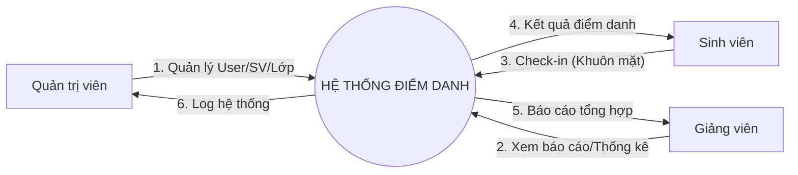

**Mô tả:**
*   **Admin:** Cung cấp dữ liệu đầu vào (danh sách sinh viên, cấu hình) và nhận lại các báo cáo quản trị.
*   **Giảng viên:** Yêu cầu xem báo cáo điểm danh của lớp mình dạy.
*   **Sinh viên:** Tương tác thụ động qua Camera để thực hiện chức năng điểm danh.

### 2.3.2. Sơ đồ phân rã mức 1 (Level 1 DFD)
Phân rã hệ thống thành các quy trình (process) chính.

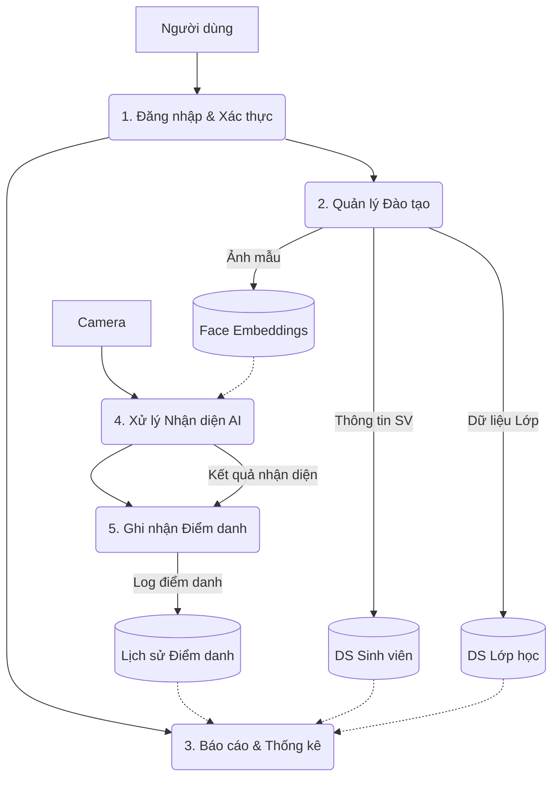

**Chi tiết các tiến trình:**

1.  **Đăng nhập & Xác thực:** Kiểm tra thông tin đăng nhập, cấp quyền truy cập (Admin/Teacher).
2.  **Quản lý Đào tạo:**
    *   Nhập liệu sinh viên, lớp học.
    *   Đăng ký và huấn luyện dữ liệu khuôn mặt (lưu vào kho `Face Embeddings`).
3.  **Báo cáo & Thống kê:** Truy vấn dữ liệu từ `Lịch sử Điểm danh` kết hợp với `DS Sinh viên` để xuất báo cáo.
4.  **Xử lý Nhận diện AI:**
    *   Nhận luồng video.
    *   Phát hiện khuôn mặt.
    *   So sánh với kho `Face Embeddings`.
5.  **Ghi nhận Điểm danh:**
    *   Nếu nhận diện thành công -> Ghi vào `Lịch sử Điểm danh`.
## 2.4. Mô hình Use Case

### 2.4.1. Danh sách tác nhân (Actors)

1.  **Admin (Quản trị viên):** Người có quyền cao nhất, chịu trách nhiệm cấu hình hệ thống, quản lý tài khoản người dùng và dữ liệu sinh viên.
2.  **Teacher (Giảng viên):** Người sử dụng hệ thống để giám sát điểm danh trong lớp học và xem báo cáo của các lớp mình phụ trách.
3.  **Student (Sinh viên):** Đối tượng được điểm danh. Tương tác chủ yếu là "bị động" (đứng trước camera) hoặc chủ động (xem lịch sử điểm danh cá nhân).
4.  **System AI (Hệ thống AI):** Tác nhân tự động thực hiện các tác vụ ngầm như phát hiện khuôn mặt, so sánh vector đặc trưng và ghi log.

### 2.4.2. Biểu đồ Use Case tổng quát

```mermaid
usecaseDiagram
    actor Admin
    actor Teacher
    actor Student
    actor SystemAI as "Hệ thống AI"

    package "Hệ thống Điểm danh" {
        usecase "Đăng nhập" as UC1
        usecase "Quản lý Sinh viên" as UC2
        usecase "Quản lý Lớp học" as UC3
        usecase "Đăng ký Khuôn mặt" as UC4
        usecase "Điểm danh (Real-time)" as UC5
        usecase "Xem Báo cáo" as UC6
        usecase "Cấu hình Hệ thống" as UC7
        usecase "Xuất Báo cáo (Excel)" as UC8
        usecase "Quản lý Người dùng" as UC9
        usecase "Xem Lịch sử Cá nhân" as UC10
    }

    Admin --> UC1
    Admin --> UC2
    Admin --> UC3
    Admin --> UC4
    Admin --> UC6
    Admin --> UC7
    Admin --> UC8
    Admin --> UC9
    
    Teacher --> UC1
    Teacher --> UC6
    Teacher --> UC3 : "Xem danh sách lớp"
    Teacher --> UC8
    
    Student --> UC4 : "Cung cấp ảnh mẫu"
    Student --> UC10
    
    SystemAI --> UC5
```

### 2.4.3. Đặc tả Use Case chi tiết

#### UC1: Đăng nhập (Login)
*   **Tác nhân:** Admin, Teacher, Student.
*   **Mục đích:** Xác thực danh tính để truy cập vào hệ thống.
*   **Luồng sự kiện chính:**
    1.  Người dùng truy cập trang đăng nhập.
    2.  Nhập `Username` và `Password`.
    3.  Hệ thống kiểm tra thông tin trong CSDL.
    4.  Nếu đúng: Chuyển hướng đến trang Dashboard tương ứng với quyền hạn.
    5.  Nếu sai: Thông báo lỗi "Sai tên đăng nhập hoặc mật khẩu".

#### UC2: Quản lý Sinh viên (Manage Students)
*   **Tác nhân:** Admin.
*   **Mục đích:** Thêm, sửa, xóa thông tin sinh viên để phục vụ điểm danh.
*   **Luồng sự kiện chính:**
    1.  Admin chọn menu "Quản lý sinh viên".
    2.  Hệ thống hiển thị danh sách sinh viên hiện có.
    3.  Admin chọn "Thêm mới" hoặc chọn một sinh viên để "Sửa/Xóa".
    4.  Nhập/Cập nhật các trường: Mã SV, Họ tên, Lớp, Email.
    5.  Hệ thống lưu thông tin vào CSDL và thông báo kết quả.

#### UC3: Quản lý Lớp học (Manage Classes)
*   **Tác nhân:** Admin, Teacher.
*   **Mục đích:** Tổ chức sinh viên vào các lớp học cụ thể.
*   **Luồng sự kiện chính:**
    1.  Admin chọn menu "Quản lý Lớp học".
    2.  Hệ thống hiển thị danh sách các lớp.
    3.  Admin chọn "Tạo lớp mới" và nhập thông tin (Tên lớp, Mã lớp, Niên khóa).
    4.  Hệ thống tạo lớp mới trong CSDL.
    5.  Giáo viên có thể xem danh sách lớp mình phụ trách.

#### UC4: Đăng ký Khuôn mặt (Register Face)
*   **Tác nhân:** Admin, Student (nếu được cấp quyền tự đăng ký).
*   **Mục đích:** Cung cấp dữ liệu mẫu để AI học và nhận diện.
*   **Luồng sự kiện chính:**
    1.  Chọn sinh viên cần đăng ký mẫu.
    2.  Chọn phương thức: "Upload ảnh" hoặc "Chụp từ Webcam".
    3.  Hệ thống kiểm tra chất lượng ảnh (độ sáng, độ rõ, góc mặt).
    4.  Nếu đạt: Hệ thống trích xuất embedding và lưu vào CSDL.
    5.  Nếu không đạt: Yêu cầu chụp lại.

#### UC5: Điểm danh (Real-time Attendance)
*   **Tác nhân:** System AI.
*   **Mục đích:** Tự động ghi nhận sự có mặt của sinh viên.
*   **Luồng sự kiện chính:**
    1.  Camera thu nhận hình ảnh liên tục (Frame-by-frame).
    2.  AI phát hiện khuôn mặt trong khung hình.
    3.  AI trích xuất đặc trưng và so sánh với kho dữ liệu.
    4.  **Điều kiện:** Nếu độ tương đồng > Ngưỡng (Threshold) VÀ chưa điểm danh trong phiên này.
    5.  Hệ thống ghi nhận bản ghi "Check-in" vào CSDL.
    6.  Hệ thống phát tín hiệu (âm thanh/hình ảnh) thông báo thành công.

#### UC6: Xem Báo cáo (View Reports)
*   **Tác nhân:** Admin, Teacher.
*   **Mục đích:** Theo dõi tình hình chuyên cần.
*   **Luồng sự kiện chính:**
    1.  Người dùng chọn menu "Báo cáo".
    2.  Chọn bộ lọc: Lớp học, Khoảng thời gian (Ngày/Tuần/Tháng).
    3.  Hệ thống truy vấn dữ liệu và hiển thị bảng thống kê.

#### UC7: Cấu hình Hệ thống (System Configuration)
*   **Tác nhân:** Admin.
*   **Mục đích:** Điều chỉnh các tham số hoạt động của hệ thống.
*   **Luồng sự kiện chính:**
    1.  Admin truy cập trang "Cài đặt".
    2.  Thay đổi các thông số: Ngưỡng nhận diện (Threshold), Camera Index, Thời gian timeout.
    3.  Lưu cấu hình.
    4.  Hệ thống áp dụng cấu hình mới ngay lập tức hoặc sau khi khởi động lại.

#### UC8: Xuất Báo cáo (Export Reports)
*   **Tác nhân:** Admin, Teacher.
*   **Mục đích:** Lưu trữ dữ liệu điểm danh dưới dạng file Excel/PDF.
*   **Luồng sự kiện chính:**
    1.  Tại màn hình xem báo cáo, người dùng nhấn nút "Xuất Excel".
    2.  Hệ thống tổng hợp dữ liệu hiện tại.
    3.  Hệ thống tạo file `.xlsx` chứa danh sách điểm danh chi tiết.
    4.  Trình duyệt tự động tải file về máy người dùng.

#### UC9: Quản lý Người dùng (Manage Users)
*   **Tác nhân:** Admin.
*   **Mục đích:** Quản lý tài khoản truy cập hệ thống (Admin, Teacher).
*   **Luồng sự kiện chính:**
    1.  Admin vào menu "Quản lý User".
    2.  Thêm tài khoản mới (Username, Password, Role).
    3.  Reset mật khẩu cho tài khoản quên mật khẩu.
    4.  Khóa/Mở khóa tài khoản.

#### UC10: Xem Lịch sử Cá nhân (View Personal History)
*   **Tác nhân:** Student.
*   **Mục đích:** Sinh viên tự theo dõi tình hình đi học của mình.
*   **Luồng sự kiện chính:**
    1.  Sinh viên đăng nhập vào hệ thống.
    2.  Chọn menu "Lịch sử điểm danh".
    3.  Hệ thống hiển thị danh sách các ngày đã điểm danh, thời gian check-in/check-out.
    4.  Hiển thị tỷ lệ chuyên cần cá nhân.

## 2.5. Biểu đồ UML

### 2.5.1. Biểu đồ Lớp (Class Diagram)
Mô hình hóa cấu trúc tĩnh của hệ thống, bao gồm các lớp thực thể và mối quan hệ giữa chúng.

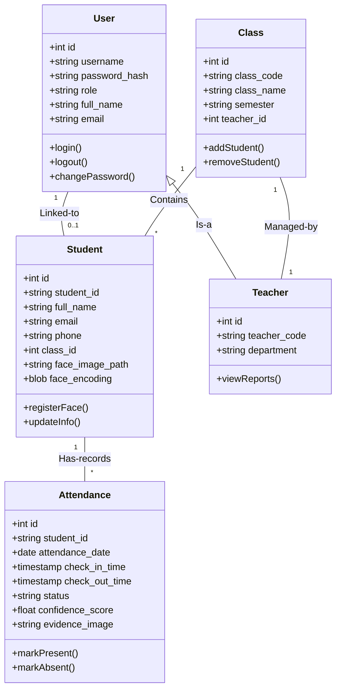

### 2.5.2. Biểu đồ Trình tự (Sequence Diagram)


#### a. Quy trình Đăng nhập (Login)
Mô tả quá trình xác thực người dùng sử dụng `werkzeug.security`.

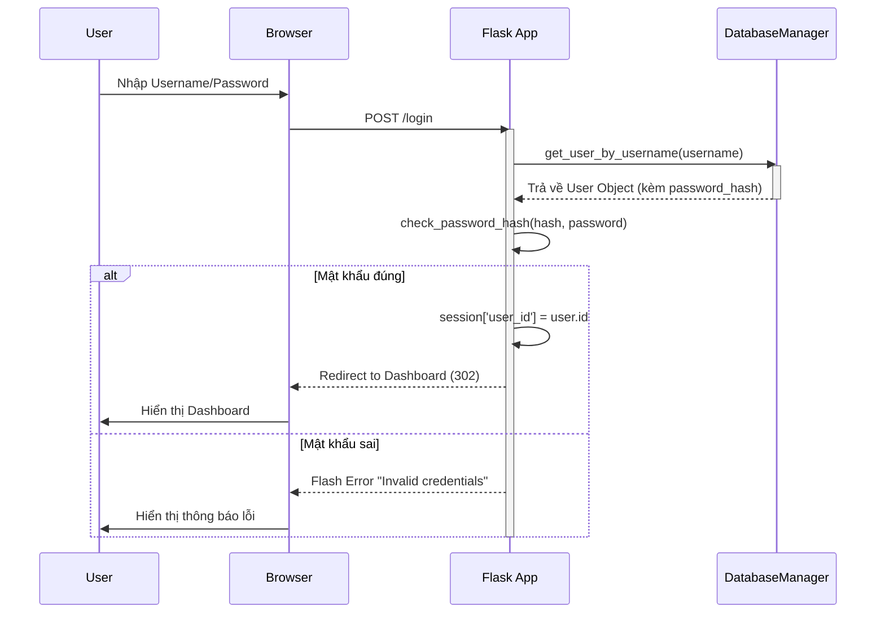

#### b. Quy trình Thu thập mẫu & Huấn luyện (Training Service)
Mô tả quá trình thu thập ảnh từ webcam và huấn luyện bộ phân loại SVM.

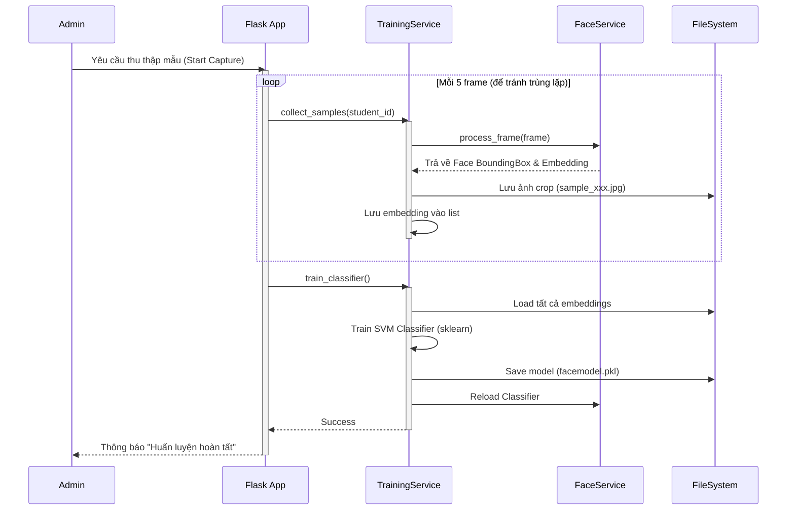

#### c. Quy trình Điểm danh tự động (Inference Engine)
Mô tả kiến trúc Strategy Pattern trong xử lý nhận diện thời gian thực.

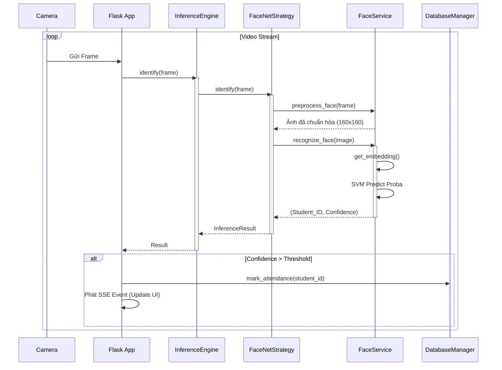

#### d. Quy trình Xem Báo cáo
Mô tả luồng truy xuất dữ liệu báo cáo.

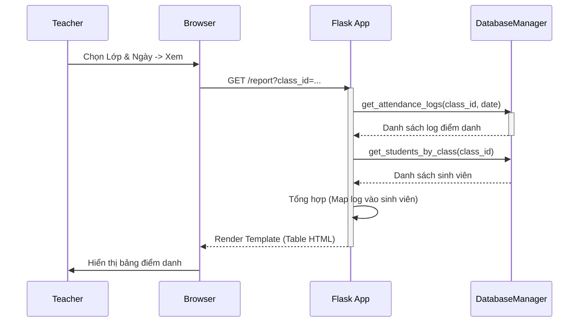

#### e. Quy trình Quản lý Lớp học (Tạo lớp & Gán sinh viên)
Mô tả quá trình Admin/Giáo viên tạo lớp và thêm sinh viên vào lớp.

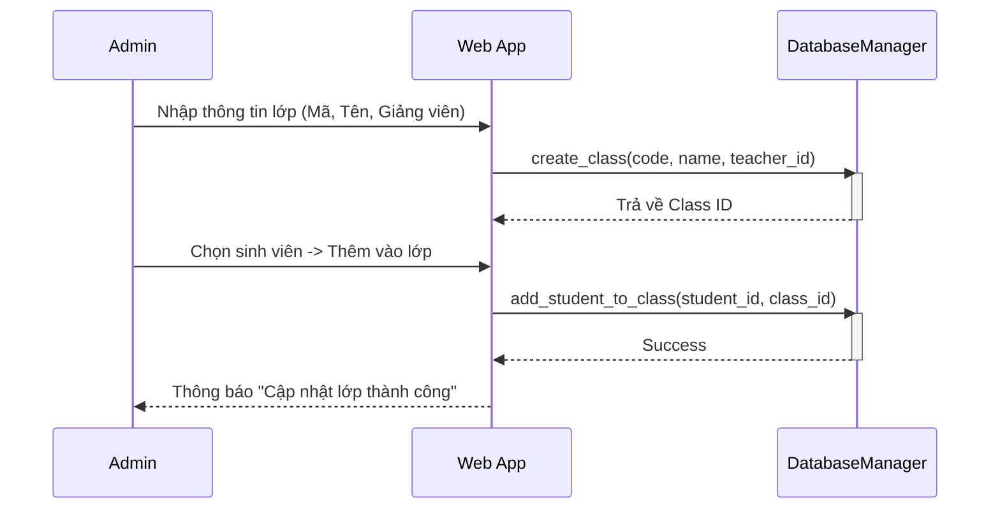

#### f. Quy trình Nhập danh sách sinh viên từ Excel
Mô tả quá trình import hàng loạt sinh viên.

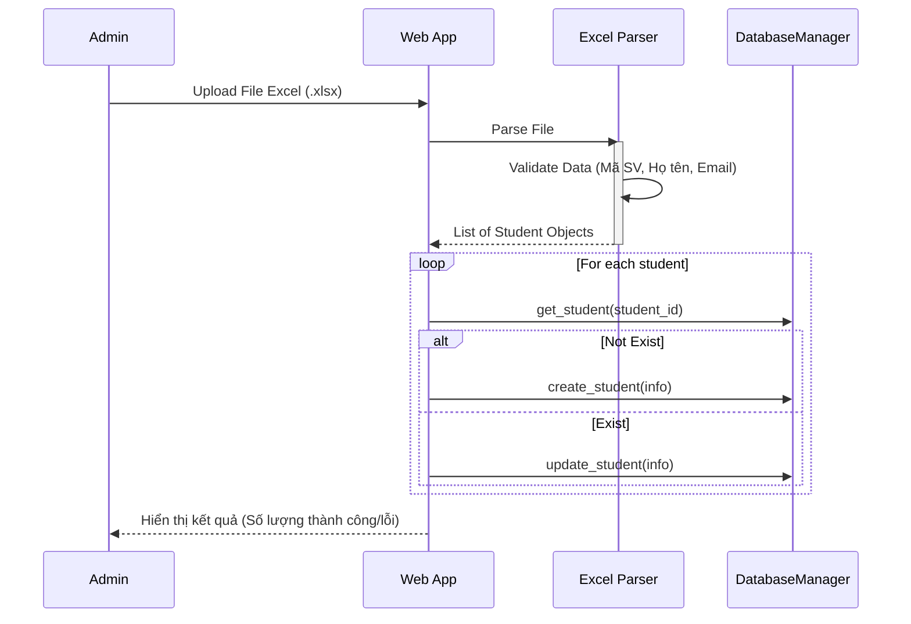

#### g. Quy trình Quản lý Người dùng (Tạo tài khoản)
Mô tả quá trình Admin tạo tài khoản mới cho Giáo viên/Nhân viên.

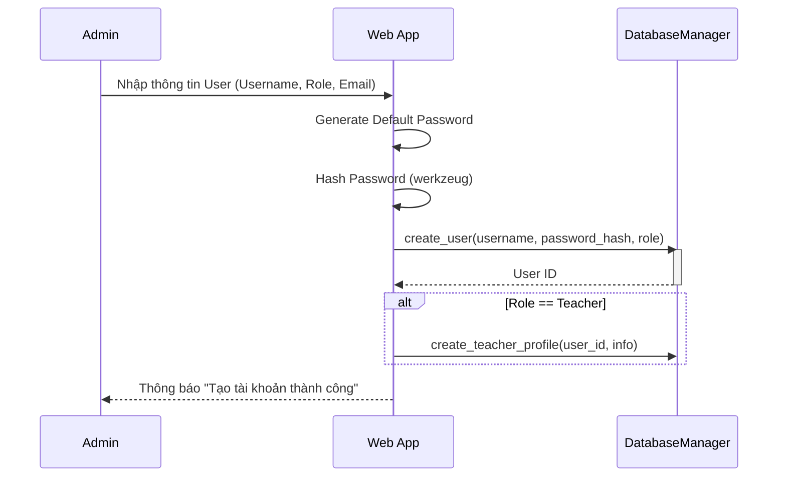

#### a. Luồng xử lý nhận diện khuôn mặt (AI Inference)
Mô tả chi tiết thuật toán xử lý từng khung hình video trong `InferenceEngine`.

**Đặc tả:**
*   **Mục đích:** Xác định danh tính sinh viên từ hình ảnh camera.
*   **Tác nhân:** Hệ thống AI (Inference Engine).
*   **Đầu vào:** Frame hình ảnh từ Camera.
*   **Đầu ra:** Student ID, Tên, Độ tin cậy, Trạng thái điểm danh.

```mermaid
graph TD
    Start([Bắt đầu Frame]) --> Input[Nhận ảnh từ Camera]
    Input --> Detect{Phát hiện khuôn mặt?}
    
    Detect -- Không --> End([Bỏ qua Frame])
    Detect -- Có --> Preprocess[Chuẩn hóa ảnh (Resize 160x160, Whitening)]
    
    Preprocess --> Strategy{Chọn chiến lược}
    
    Strategy -- DeepFace --> DF_Embed[Trích xuất Embedding (Facenet512)]
    DF_Embed --> DF_Match[So sánh Cosine Similarity]
    
    Strategy -- FaceNet --> FN_Embed[Trích xuất Embedding (FaceNet Legacy)]
    FN_Embed --> FN_Match[Phân loại SVM (Predict Proba)]
    
    DF_Match & FN_Match --> Threshold{Độ tin cậy > Ngưỡng?}
    
    Threshold -- No --> Unknown[Đánh dấu 'Unknown'] --> Draw[Vẽ khung đỏ]
    
    Threshold -- Yes --> Identify[Xác định Student ID]
    Identify --> Cooldown{Kiểm tra Cooldown (30s)}
    
    Cooldown -- Chưa hết --> DrawInfo[Vẽ khung xanh + Tên]
    Cooldown -- Đã hết --> CheckSession{Có phiên điểm danh mở?}
    
    CheckSession -- Không --> DrawInfo
    CheckSession -- Có --> LogDB[Ghi nhận Check-in/Check-out]
    LogDB --> SSE[Gửi sự kiện SSE cập nhật UI] --> DrawInfo
    
    Draw --> Display[Hiển thị lên màn hình]
    DrawInfo --> Display
    Display --> End
```

#### b. Luồng quản lý phiên điểm danh (Session Management)
Mô tả vòng đời của một phiên điểm danh lớp học.

**Đặc tả:**
*   **Mục đích:** Quản lý thời gian và trạng thái của buổi học.
*   **Tác nhân:** Giảng viên, Hệ thống.
*   **Điều kiện:** Lớp học đã được tạo.
*   **Kết quả:** Danh sách sinh viên có mặt/vắng mặt trong phiên.

```mermaid
graph TD
    Start([Giảng viên bắt đầu]) --> OpenSession[Mở phiên điểm danh]
    OpenSession --> SetConfig[Thiết lập: Lớp, Thời gian, Loại (Vào/Ra)]
    
    SetConfig --> ActiveState{Trạng thái Phiên}
    
    ActiveState -- Đang mở --> Monitor[Giám sát thời gian thực]
    Monitor --> CheckDeadline{Hết hạn check-in?}
    
    CheckDeadline -- Chưa --> Wait[Chờ sinh viên]
    Wait --> Process[Xử lý điểm danh AI] --> Monitor
    
    CheckDeadline -- Rồi --> AutoClose[Tự động đóng phiên]
    
    ActiveState -- Yêu cầu đóng --> ManualClose[Giảng viên bấm 'Kết thúc']
    
    AutoClose & ManualClose --> CalcStats[Tính toán thống kê]
    CalcStats --> UpdateStatus[Cập nhật trạng thái: Vắng/Muộn]
    UpdateStatus --> End([Kết thúc phiên])
```

#### c. Luồng đồng bộ dữ liệu (Data Synchronization)
Mô tả cách hệ thống đồng bộ dữ liệu giữa bộ nhớ (RAM) và Cơ sở dữ liệu (Disk).

**Đặc tả:**
*   **Mục đích:** Đảm bảo dữ liệu nhận diện luôn sẵn sàng và cập nhật.
*   **Tác nhân:** Hệ thống (Background Service).
*   **Kích hoạt:** Khi khởi động app hoặc có thay đổi dữ liệu sinh viên.
*   **Kết quả:** Cache embeddings trong RAM đồng bộ với DB.

```mermaid
graph TD
    Start([Khởi động ứng dụng]) --> LoadDB[Đọc cấu hình từ DB]
    LoadDB --> InitEngine[Khởi tạo Inference Engine]
    
    InitEngine --> CheckCache{Có Cache Embeddings?}
    
    CheckCache -- Không --> ScanDir[Quét thư mục data/]
    ScanDir --> BuildEmbed[Tạo Embeddings mới] --> SaveCache[Lưu Cache (.pkl/.npy)]
    
    CheckCache -- Có --> LoadCache[Load Embeddings vào RAM]
    
    SaveCache & LoadCache --> Ready([Sẵn sàng nhận diện])
    
    Ready --> Event{Sự kiện thay đổi?}
    Event -- Thêm SV mới --> UpdateRAM[Cập nhật List Embeddings trong RAM]
    Event -- Xóa SV --> RemoveRAM[Xóa khỏi RAM]
    
    UpdateRAM & RemoveRAM --> Ready
```

#### d. Quy trình Đăng ký khuôn mặt (Face Registration)
Mô tả quá trình đăng ký khuôn mặt mới qua API `api_quick_register`.

**Đặc tả:**
*   **Mục đích:** Thêm sinh viên mới và dữ liệu khuôn mặt vào hệ thống.
*   **Tác nhân:** Admin/Giáo viên.
*   **Đầu vào:** Mã SV, Tên, Ảnh chân dung.
*   **Kết quả:** Sinh viên được lưu vào DB và sẵn sàng để nhận diện.

```mermaid
graph TD
    Start([Bắt đầu]) --> Input[Nhận dữ liệu: ID, Tên, Ảnh (File/Base64)]
    Input --> Validate{Kiểm tra dữ liệu}
    
    Validate -- Thiếu thông tin --> Error([Trả về lỗi 400])
    Validate -- Đủ thông tin --> CheckImg{Loại ảnh?}
    
    CheckImg -- Base64 --> Decode[Decode Base64 -> Bytes]
    CheckImg -- File Upload --> Read[Đọc file upload]
    
    Decode & Read --> ValidateImg{Validate Ảnh}
    ValidateImg -- Lỗi (Size/Format) --> Error
    
    ValidateImg -- Hợp lệ --> Save[Lưu ảnh vào thư mục data/]
    Save --> AddDB[Thêm thông tin vào DB]
    
    AddDB --> Reload[Reload Known Faces (Load lại Embeddings)]
    Reload --> Success([Trả về thành công])
```

#### e. Quy trình Huấn luyện mô hình (Model Training)
Mô tả quá trình huấn luyện lại mô hình phân loại SVM khi có dữ liệu mới.

**Đặc tả:**
*   **Mục đích:** Cập nhật model AI để nhận diện các khuôn mặt mới.
*   **Tác nhân:** Admin.
*   **Điều kiện:** Có dữ liệu ảnh mới trong thư mục `data/`.
*   **Kết quả:** File model `.pkl` mới được tạo và load vào hệ thống.

```mermaid
graph TD
    Start([Admin yêu cầu Train]) --> CheckService{FaceNet Service?}
    CheckService -- No --> Error([Lỗi: Service Unavailable])
    
    CheckService -- Yes --> Init[Khởi tạo TrainingService]
    Init --> LoadData[Load toàn bộ ảnh từ data/]
    
    LoadData --> Extract[Trích xuất Embeddings (FaceNet)]
    Extract --> Train[Huấn luyện SVM Classifier]
    
    Train --> Save[Lưu model (.pkl)]
    Save --> UpdateEngine[Cập nhật Inference Engine]
    
    UpdateEngine --> Success([Hoàn tất Training])
```

#### f. Quy trình Xác thực người dùng (Authentication)
Mô tả quá trình đăng nhập hệ thống.

**Đặc tả:**
*   **Mục đích:** Bảo mật truy cập vào hệ thống quản trị.
*   **Tác nhân:** Người dùng (Admin, Teacher).
*   **Đầu vào:** Username, Password.
*   **Kết quả:** Session đăng nhập hợp lệ hoặc thông báo lỗi.

```mermaid
graph TD
    Start([Người dùng nhập Credential]) --> Submit[POST /login]
    Submit --> Query[Tìm User theo Username]
    
    Query --> Exist{User tồn tại?}
    Exist -- Không --> Fail[Báo lỗi: Sai thông tin]
    
    Exist -- Có --> Verify{Check Password Hash}
    Verify -- Sai --> Fail
    
    Verify -- Đúng --> Login[Tạo Session (Flask-Login)]
    Login --> UpdateLog[Cập nhật Last Login]
    UpdateLog --> Redirect[Chuyển hướng trang chủ]
    Redirect --> End([Đăng nhập thành công])
```
## 2.6. Thiết kế Cơ sở dữ liệu

Hệ thống sử dụng cơ sở dữ liệu quan hệ (SQLite) để lưu trữ thông tin. Dưới đây là thiết kế chi tiết của các bảng và mối quan hệ giữa chúng.

### 2.6.1. Mô hình Quan hệ Thực thể (ERD)

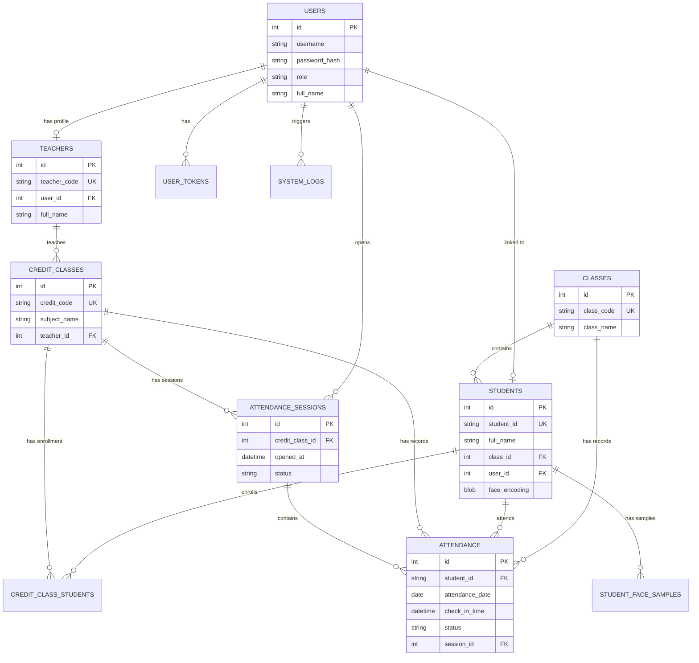

### 2.6.2. Danh sách bảng chi tiết

#### 1. Bảng `users` (Người dùng)
Lưu trữ thông tin tài khoản đăng nhập hệ thống (Admin, Giảng viên, Sinh viên).

| Tên cột | Kiểu dữ liệu | Ràng buộc | Mô tả |
| :--- | :--- | :--- | :--- |
| `id` | INTEGER | PK, Auto Increment | ID duy nhất của user |
| `username` | VARCHAR(50) | UNIQUE, NOT NULL | Tên đăng nhập |
| `password_hash` | VARCHAR(255) | NOT NULL | Mật khẩu đã mã hóa (SHA-256) |
| `full_name` | VARCHAR(100) | NOT NULL | Họ và tên hiển thị |
| `role` | VARCHAR(20) | DEFAULT 'teacher' | Vai trò: `admin`, `teacher`, `student` |
| `email` | VARCHAR(100) | | Email liên hệ |
| `is_active` | BOOLEAN | DEFAULT 1 | Trạng thái hoạt động |
| `last_login` | TIMESTAMP | | Thời gian đăng nhập cuối cùng |

#### 2. Bảng `students` (Sinh viên)
Lưu trữ thông tin hồ sơ sinh viên và dữ liệu khuôn mặt chính.

| Tên cột | Kiểu dữ liệu | Ràng buộc | Mô tả |
| :--- | :--- | :--- | :--- |
| `id` | INTEGER | PK, Auto Increment | ID nội bộ |
| `student_id` | VARCHAR(20) | UNIQUE, NOT NULL | Mã số sinh viên (Business Key) |
| `full_name` | VARCHAR(100) | NOT NULL | Họ tên sinh viên |
| `class_id` | INTEGER | FK -> classes(id) | Lớp niên chế |
| `user_id` | INTEGER | FK -> users(id) | Tài khoản liên kết (để xem điểm danh) |
| `face_encoding` | BLOB | | Vector đặc trưng khuôn mặt (Legacy) |
| `face_image_path` | VARCHAR(200) | | Đường dẫn ảnh đại diện |
| `status` | VARCHAR(20) | DEFAULT 'active' | Trạng thái học tập |

#### 3. Bảng `teachers` (Giảng viên)
Lưu trữ thông tin hồ sơ giảng viên.

| Tên cột | Kiểu dữ liệu | Ràng buộc | Mô tả |
| :--- | :--- | :--- | :--- |
| `id` | INTEGER | PK, Auto Increment | ID nội bộ |
| `teacher_code` | VARCHAR(20) | UNIQUE, NOT NULL | Mã giảng viên |
| `full_name` | VARCHAR(100) | NOT NULL | Họ tên giảng viên |
| `user_id` | INTEGER | UNIQUE, FK -> users(id) | Tài khoản đăng nhập liên kết |
| `department` | VARCHAR(100) | | Khoa/Bộ môn |

#### 4. Bảng `classes` (Lớp niên chế)
Lưu trữ thông tin lớp hành chính/niên chế.

| Tên cột | Kiểu dữ liệu | Ràng buộc | Mô tả |
| :--- | :--- | :--- | :--- |
| `id` | INTEGER | PK, Auto Increment | ID lớp |
| `class_code` | VARCHAR(20) | UNIQUE, NOT NULL | Mã lớp |
| `class_name` | VARCHAR(100) | NOT NULL | Tên lớp |
| `academic_year` | VARCHAR(20) | | Niên khóa |

#### 5. Bảng `credit_classes` (Lớp tín chỉ)
Lưu trữ thông tin các lớp học phần/tín chỉ mà giảng viên dạy.

| Tên cột | Kiểu dữ liệu | Ràng buộc | Mô tả |
| :--- | :--- | :--- | :--- |
| `id` | INTEGER | PK, Auto Increment | ID lớp tín chỉ |
| `credit_code` | VARCHAR(30) | UNIQUE, NOT NULL | Mã lớp học phần |
| `subject_name` | VARCHAR(150) | NOT NULL | Tên môn học |
| `teacher_id` | INTEGER | FK -> teachers(id) | Giảng viên phụ trách |
| `semester` | VARCHAR(20) | | Học kỳ |
| `schedule_info` | TEXT | | Thông tin lịch học |

#### 6. Bảng `attendance_sessions` (Phiên điểm danh)
Quản lý các phiên điểm danh được mở cho lớp tín chỉ.

| Tên cột | Kiểu dữ liệu | Ràng buộc | Mô tả |
| :--- | :--- | :--- | :--- |
| `id` | INTEGER | PK, Auto Increment | ID phiên |
| `credit_class_id` | INTEGER | NOT NULL, FK | Lớp tín chỉ của phiên này |
| `opened_by` | INTEGER | FK -> users(id) | Người mở phiên |
| `session_date` | DATE | NOT NULL | Ngày điểm danh |
| `checkin_deadline` | TIMESTAMP | | Thời hạn check-in |
| `status` | VARCHAR(20) | DEFAULT 'scheduled' | `open`, `closed`, `expired` |

#### 7. Bảng `attendance` (Dữ liệu điểm danh)
Lưu trữ chi tiết từng lượt điểm danh của sinh viên.

| Tên cột | Kiểu dữ liệu | Ràng buộc | Mô tả |
| :--- | :--- | :--- | :--- |
| `id` | INTEGER | PK, Auto Increment | ID bản ghi |
| `student_id` | VARCHAR(20) | NOT NULL, FK | Mã sinh viên |
| `attendance_date` | DATE | NOT NULL | Ngày điểm danh |
| `check_in_time` | TIMESTAMP | | Thời gian vào |
| `check_out_time` | TIMESTAMP | | Thời gian ra |
| `status` | VARCHAR(20) | DEFAULT 'present' | `present`, `late`, `absent` |
| `confidence_score` | REAL | | Độ tin cậy của AI |
| `session_id` | INTEGER | FK -> attendance_sessions | Thuộc phiên điểm danh nào |

#### 8. Bảng `student_face_samples` (Dữ liệu huấn luyện)
Lưu trữ nhiều ảnh mẫu cho mỗi sinh viên để huấn luyện AI tốt hơn.

| Tên cột | Kiểu dữ liệu | Ràng buộc | Mô tả |
| :--- | :--- | :--- | :--- |
| `id` | INTEGER | PK, Auto Increment | ID mẫu |
| `student_id` | VARCHAR(20) | NOT NULL, FK | Mã sinh viên |
| `image_path` | VARCHAR(200) | NOT NULL | Đường dẫn ảnh |
| `embedding` | BLOB | | Vector đặc trưng |
| `is_primary` | BOOLEAN | DEFAULT 0 | Ảnh đại diện chính? |

#### 9. Bảng `settings` (Cấu hình)
Lưu trữ các tham số cấu hình hệ thống động.

| Tên cột | Kiểu dữ liệu | Ràng buộc | Mô tả |
| :--- | :--- | :--- | :--- |
| `setting_key` | VARCHAR(50) | UNIQUE, NOT NULL | Khóa cấu hình |
| `setting_value` | TEXT | | Giá trị |

#### 10. Bảng `system_logs` (Nhật ký hệ thống)
Ghi lại các hoạt động quan trọng và lỗi.

| Tên cột | Kiểu dữ liệu | Ràng buộc | Mô tả |
| :--- | :--- | :--- | :--- |
| `log_level` | VARCHAR(20) | NOT NULL | INFO, WARNING, ERROR |
| `message` | TEXT | | Nội dung log |
| `user_id` | INTEGER | FK -> users(id) | Người thực hiện (nếu có) |

## 2.7. Thuật toán và mô hình sử dụng

Hệ thống áp dụng các kỹ thuật tiên tiến trong lĩnh vực Thị giác máy tính (Computer Vision) và Học sâu (Deep Learning) để đảm bảo độ chính xác và hiệu năng.

### 2.7.1. Mạng Nơ-ron Tích chập (CNN - Convolutional Neural Networks)
CNN là kiến trúc cốt lõi được sử dụng trong toàn bộ quy trình xử lý ảnh của hệ thống, từ phát hiện khuôn mặt đến trích xuất đặc trưng.
*   **Vai trò:** Tự động học các đặc trưng phân cấp của khuôn mặt (cạnh, góc, mắt, mũi, cấu trúc tổng thể) thay vì sử dụng các đặc trưng thủ công (hand-crafted features).
*   **Ứng dụng:**
    *   **Phát hiện khuôn mặt (Face Detection):** Sử dụng trong các mô hình như MTCNN (Multi-task Cascaded Convolutional Networks) hoặc YOLOv8 (You Only Look Once) để định vị khuôn mặt trong khung hình.
    *   **Trích xuất đặc trưng (Feature Extraction):** Biến đổi hình ảnh khuôn mặt đã căn chỉnh thành một vector số học (embedding).

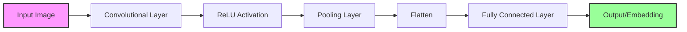

### 2.7.2. Mạng ResNet (Residual Networks)
Hệ thống sử dụng kiến trúc ResNet (cụ thể là Inception-ResNet v1 trong FaceNet hoặc ResNet-34 trong Dlib) để giải quyết vấn đề "vanishing gradient" khi huấn luyện các mạng rất sâu.
*   **Cơ chế:** Sử dụng các kết nối tắt (skip connections) cho phép tín hiệu truyền trực tiếp qua các lớp, giúp mạng học được các đặc trưng phức tạp hơn mà không bị suy giảm hiệu năng.
*   **Mô hình cụ thể:**
    *   **Inception-ResNet v1 (FaceNet):** Kết hợp khối Inception (xử lý đa tỷ lệ) với khối Residual, giúp mô hình vừa rộng vừa sâu, tối ưu hóa cho việc nhận diện khuôn mặt với độ chính xác cao (99.63% trên LFW dataset).
    *   **ResNet-34 (Dlib):** Mạng ResNet 34 lớp được huấn luyện trên tập dữ liệu 3 triệu khuôn mặt, dùng cho chế độ fallback hoặc khi cần tốc độ cao.

```mermaid
graph LR
    Input[Input x] --> Weight1[Weight Layer]
    Weight1 --> ReLU[ReLU]
    ReLU --> Weight2[Weight Layer]
    Weight2 --> Add((+))
    Input -->|Skip Connection| Add
    Add --> Output[Output F(x) + x]
    
    style Add fill:#ff9,stroke:#333,stroke-width:2px
```

### 2.7.3. Thư viện Dlib Facial Recognition
Dlib được sử dụng như một giải pháp dự phòng (fallback) hoặc lựa chọn thay thế nhẹ nhàng cho FaceNet/DeepFace.
*   **Quy trình:**
    1.  **HOG (Histogram of Oriented Gradients):** Để phát hiện khuôn mặt nhanh (hoặc CNN MMOD cho độ chính xác cao hơn).
    2.  **Pose Estimator:** Xác định 68 điểm landmark để căn chỉnh khuôn mặt (face alignment).
    3.  **Deep Metric Learning:** Chuyển đổi khuôn mặt thành vector 128 chiều (128-d embedding) sao cho các khuôn mặt giống nhau có khoảng cách gần nhau.

```mermaid
graph TD
    Img[Input Image] --> Detect[Face Detection (HOG/CNN)]
    Detect --> Align[Shape Predictor (68 Landmarks)]
    Align --> Crop[Face Alignment & Crop]
    Crop --> ResNet[ResNet-34 Model]
    ResNet --> Embed[128D Embedding]
```

### 2.7.4. So khớp khoảng cách Euclidean (Euclidean Distance Matching)
Để xác định danh tính, hệ thống so sánh vector đặc trưng của khuôn mặt hiện tại với các vector đã lưu trong cơ sở dữ liệu.
*   **Công thức:** Khoảng cách Euclidean $d(A, B)$ giữa hai vector $A$ và $B$:
    $$ d(A, B) = \sqrt{\sum_{i=1}^{n} (A_i - B_i)^2} $$
*   **Cơ chế hoạt động:**
    *   Tính khoảng cách giữa vector khuôn mặt mới và tất cả vector đã biết.
    *   Nếu khoảng cách nhỏ hơn một ngưỡng (**Threshold**, thường là 0.45 - 0.6), hệ thống xác định đó là cùng một người.
    *   Chọn người có khoảng cách nhỏ nhất (người giống nhất).
*   **Ưu điểm:** Đơn giản, hiệu quả tính toán cao và trực quan trong không gian vector nhiều chiều.

```mermaid
graph TD
    Cam[Camera Face] --> Embed1[Vector A]
    DB[Database Face] --> Embed2[Vector B]
    Embed1 & Embed2 --> Calc[Calculate Distance d(A,B)]
    Calc --> Check{d < Threshold?}
    Check -- Yes --> Match[Match Found]
    Check -- No --> NoMatch[Unknown Person]
    
    style Match fill:#9f9,stroke:#333,stroke-width:2px
    style NoMatch fill:#f99,stroke:#333,stroke-width:2px
```

## 2.8. Công nghệ nền tảng sử dụng

Hệ thống được xây dựng dựa trên các công nghệ mã nguồn mở mạnh mẽ, đảm bảo tính ổn định, hiệu năng và khả năng mở rộng.

### 2.8.1. Ngôn ngữ lập trình Python
Python là ngôn ngữ chủ đạo của dự án nhờ hệ sinh thái phong phú cho AI và Web.
*   **Phiên bản:** Python 3.8+
*   **Lý do lựa chọn:** Cú pháp đơn giản, hỗ trợ mạnh mẽ các thư viện xử lý ảnh (OpenCV) và học máy (TensorFlow, Scikit-learn).

### 2.8.2. Thư viện OpenCV (Open Source Computer Vision Library)
OpenCV đóng vai trò trung tâm trong việc thu nhận và xử lý hình ảnh từ camera.
*   **Chức năng:**
    *   Đọc luồng video thời gian thực (Video Capture).
    *   Tiền xử lý ảnh: Chuyển đổi không gian màu (BGR sang RGB/Gray), thay đổi kích thước (Resize), vẽ khung hình chữ nhật và nhãn tên lên giao diện.

### 2.8.3. Dlib / face_recognition
Đây là bộ thư viện cốt lõi cho chức năng nhận diện khuôn mặt (khi không sử dụng FaceNet).
*   **Dlib:** Cung cấp các thuật toán HOG (Histogram of Oriented Gradients) và CNN để phát hiện khuôn mặt và xác định 68 điểm đặc trưng.
*   **face_recognition:** Là wrapper cao cấp của Dlib, giúp đơn giản hóa việc mã hóa khuôn mặt và so sánh khoảng cách Euclidean với độ chính xác cao (99.38% trên LFW).

### 2.8.4. Hệ quản trị cơ sở dữ liệu (SQLite / MySQL)
Hệ thống được thiết kế để linh hoạt trong việc lưu trữ dữ liệu.
*   **SQLite (Hiện tại):** Được sử dụng mặc định vì tính gọn nhẹ, không cần cài đặt server riêng, phù hợp cho triển khai cục bộ hoặc quy mô nhỏ/vừa. Toàn bộ dữ liệu (sinh viên, điểm danh, logs) được lưu trong một file `.db` duy nhất.
*   **MySQL (Tùy chọn mở rộng):** Kiến trúc hệ thống cho phép chuyển đổi sang MySQL dễ dàng khi cần triển khai trên môi trường production với lượng dữ liệu lớn và yêu cầu truy cập đồng thời cao.

### 2.8.5. Web Framework (Flask)
Flask được chọn làm nền tảng phát triển ứng dụng web (Backend & Frontend).
*   **Vai trò:**
    *   **Backend API:** Cung cấp các RESTful API cho việc quản lý sinh viên, điểm danh và giao tiếp với các client khác.
    *   **Web Server:** Phục vụ giao diện người dùng (HTML/CSS/JS) và xử lý logic nghiệp vụ.
    *   **Streaming:** Hỗ trợ stream video từ camera lên trình duyệt thông qua Multipart responses.
*   *Lưu ý: Streamlit có thể được sử dụng cho các module dashboard phân tích dữ liệu nhanh hoặc demo, nhưng Flask là framework chính của ứng dụng.*

---
*Kết thúc Chương 2.*