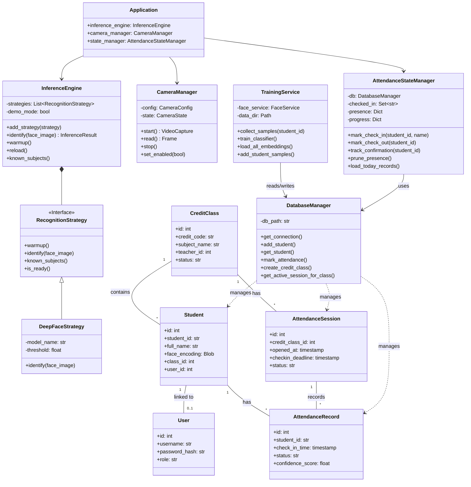
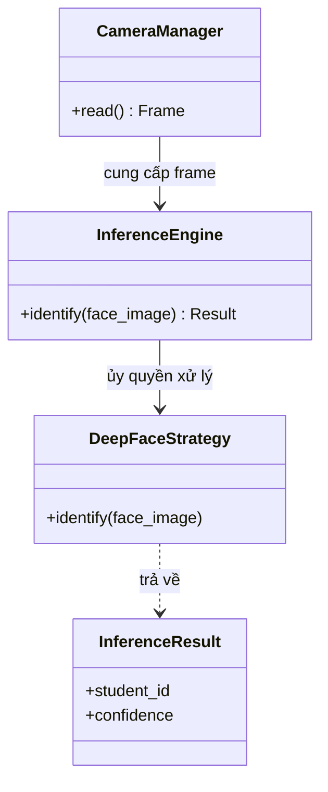
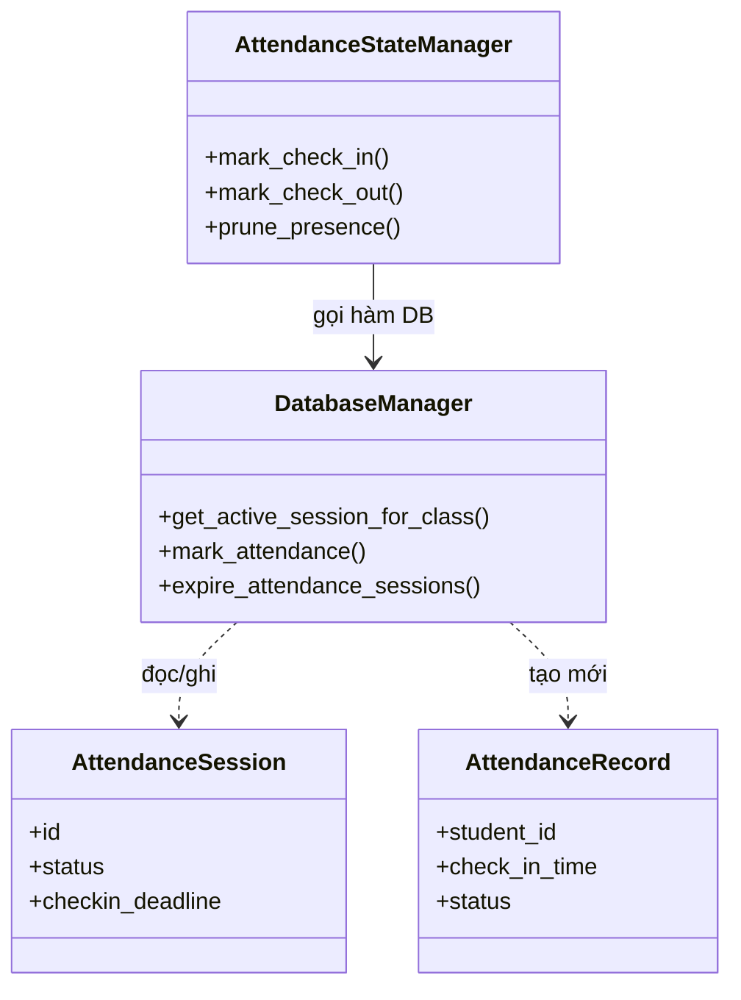
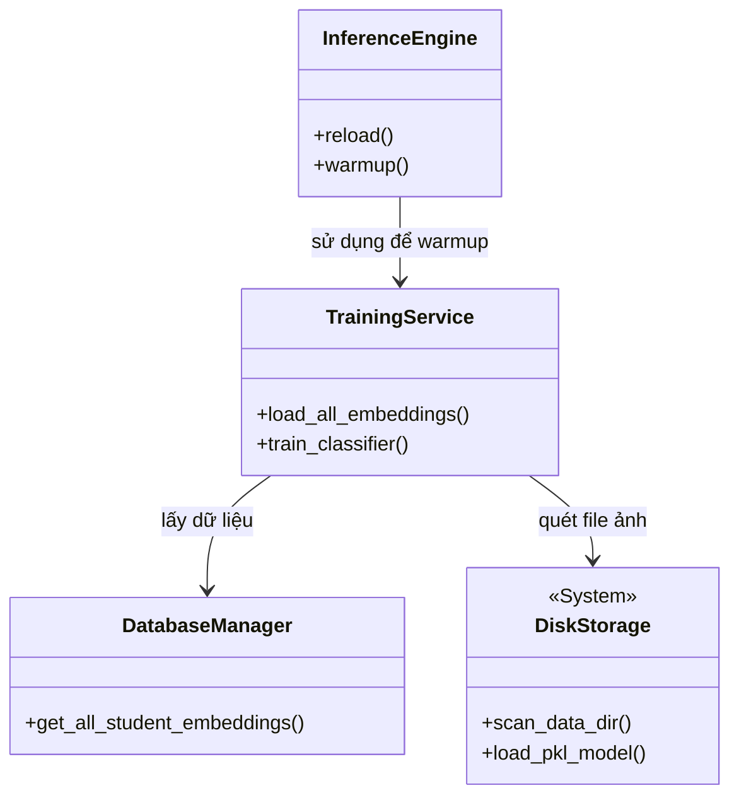
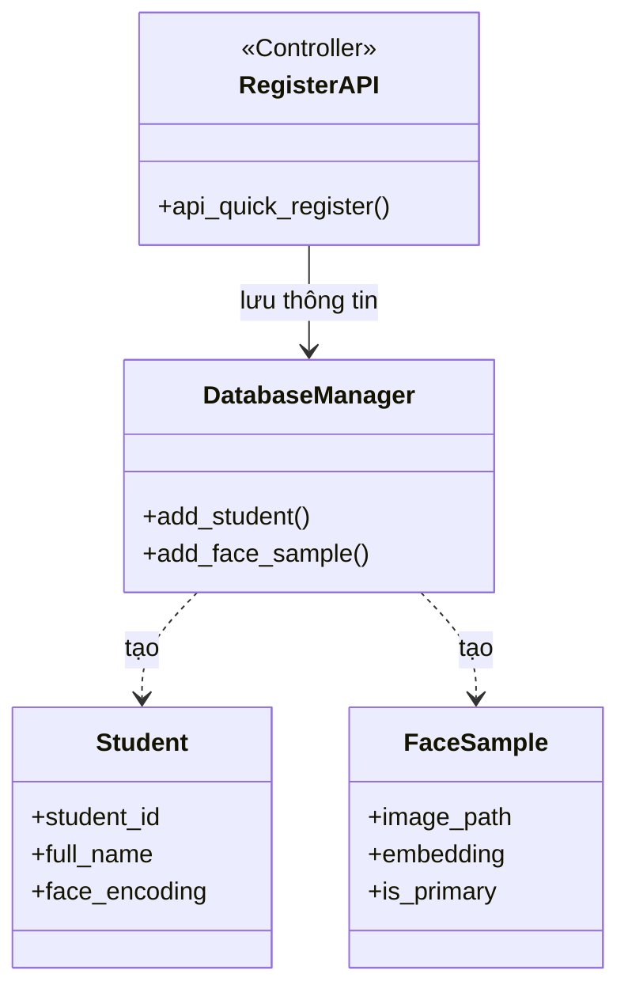
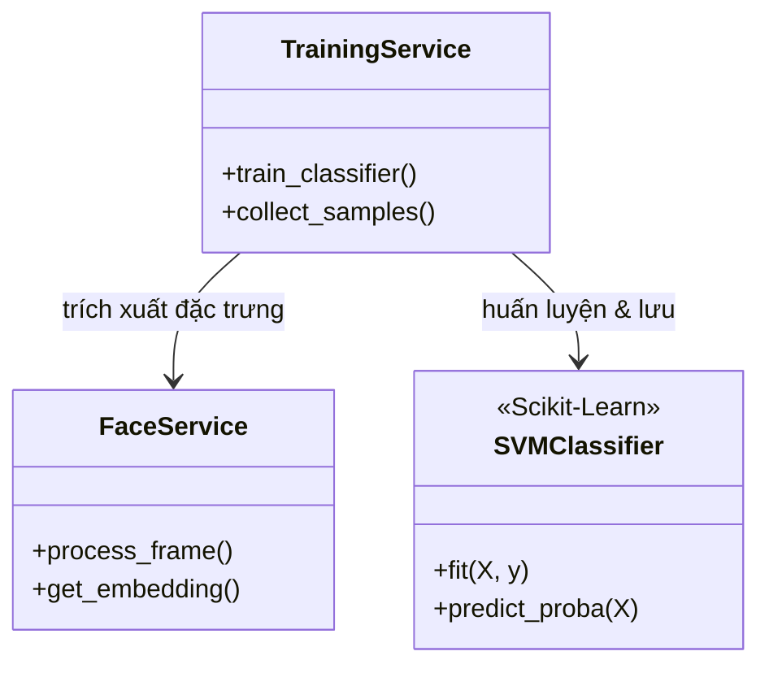
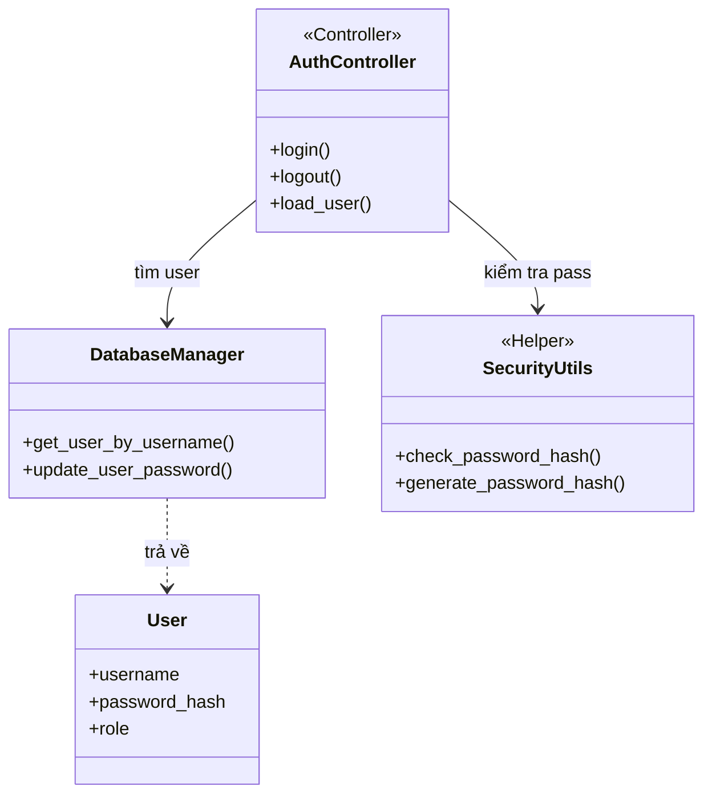

# TỔNG HỢP BIỂU ĐỒ LỚP (CLASS DIAGRAMS)

Tài liệu này bao gồm:
1.  **Biểu đồ Lớp Hệ thống (System Class Diagram):** Cái nhìn tổng quan về cấu trúc tĩnh của toàn bộ hệ thống.
2.  **Biểu đồ Lớp theo Ca sử dụng (Use Case Class Diagrams):** Chi tiết các lớp tham gia (VOPC) cho 6 luồng nghiệp vụ chính.

---

# PHẦN 1: Biểu đồ Lớp Hệ thống (System Class Diagram)

Biểu đồ này mô hình hóa cấu trúc tĩnh của hệ thống, bao gồm các lớp xử lý chính, thực thể dữ liệu (Entities) và mối quan hệ giữa chúng.

> [!NOTE]
> Biểu đồ tập trung vào các lớp cốt lõi tham gia vào các ca sử dụng chính: Nhận diện, Điểm danh, Đồng bộ và Quản lý.

## Giải thích chi tiết

### Core Logic Layers
*   **InferenceEngine**: Đóng vai trò là "bộ não" AI, sử dụng mẫu thiết kế Strategy để hỗ trợ nhiều thuật toán nhận diện (DeepFace, FaceNet).
*   **CameraManager**: Trừu tượng hóa việc điều khiển phần cứng camera, xử lý warmup và buffer.
*   **AttendanceStateManager**: Quản lý logic nghiệp vụ điểm danh thời gian thực, bao gồm việc theo dõi "sự hiện diện" (presence) để tránh spam check-in và xử lý time-out.

### Service Layer
*   **TrainingService**: Chịu trách nhiệm về quy trình Machine Learning (thu thập ảnh, trích xuất đặc trưng, huấn luyện SVM).

### Data Entities (Mô hình dữ liệu)
*   **Student**: Đại diện cho sinh viên, chứa thông tin định danh và vector khuôn mặt (face_encoding).
*   **CreditClass & AttendanceSession**: Quản lý cấu trúc lớp học tín chỉ và từng buổi học cụ thể.
*   **AttendanceRecord**: Lưu lịch sử điểm danh của từng sinh viên trong mỗi phiên.

---

# PHẦN 2: Biểu đồ Lớp theo Ca sử dụng (Use Case Class Diagrams)

Phần này cung cấp các biểu đồ lớp chi tiết (View of Participating Classes - VOPC) cho 6 ca sử dụng chính, chỉ hiển thị các lớp tham gia trực tiếp.

## 1. Ca sử dụng: Nhận diện Khuôn mặt (AI Inference)
Các lớp tham gia vào quá trình xử lý luồng video và nhận diện.

## 2. Ca sử dụng: Quản lý Phiên Điểm danh (Session Management)
Các lớp tham gia vào việc tạo và quản lý vòng đời phiên học.

## 3. Ca sử dụng: Đồng bộ Dữ liệu (Data Synchronization)
Các lớp tham gia vào quá trình nạp dữ liệu từ Disk lên RAM.

## 4. Ca sử dụng: Đăng ký Khuôn mặt (Face Registration)
Các lớp xử lý việc thêm mới sinh viên và mẫu khuôn mặt.

## 5. Ca sử dụng: Huấn luyện Mô hình (Model Training)
Các lớp tham gia vào việc huấn luyện lại bộ phân loại SVM.

## 6. Ca sử dụng: Xác thực Người dùng (Authentication)
Các lớp tham gia vào quá trình đăng nhập và bảo mật.

